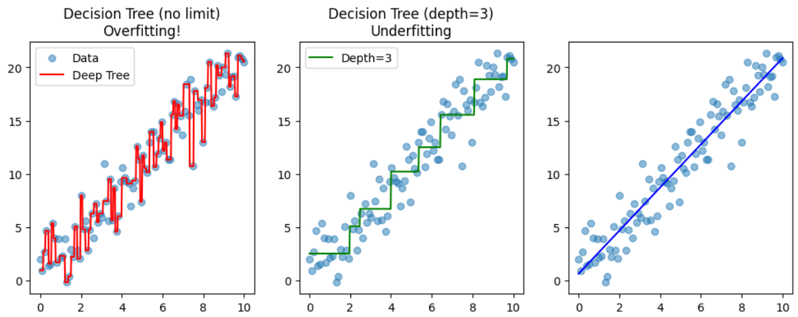
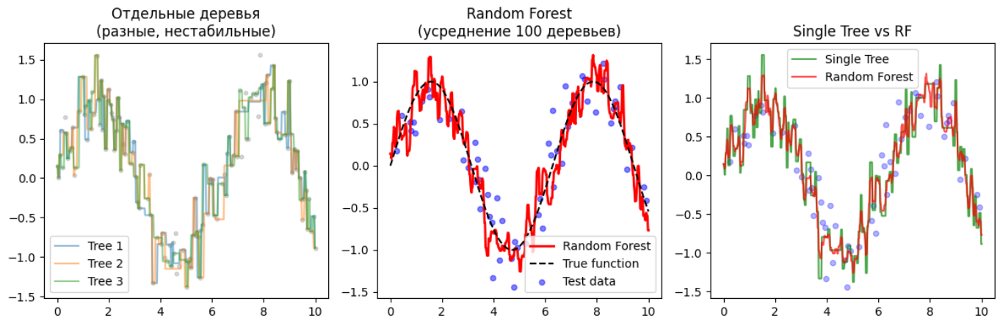

# Дерево решений (Decision Tree)

Дерево решений — это серия вложенных if-else вопросов к признакам:

```
                      [возраст > 30?]
                         /        \
                       Да          Нет
                      /              \
              [доход > 50K?]      [доход > 20K?]
                /      \            /      \
              Да       Нет         Да       Нет
             /          \          /          \
        [одобрено]   [отказ]   [одобрено]   [отказ]
```

Модель — это просто набор правил. Не нужны матричные умножения, веса, градиенты.

| Характеристика | Что значит
|--|--
| Инференс O(log n) | Чтобы предсказать, нужно пройти от корня до листа (глубина ~20-30 шагов)
| Не нужна нормализация | Дерево спрашивает "возраст > 30?", масштаб не важен
| Интерпретируемость | Можно объяснить бизнесу: "вам отказали, потому что возраст < 25 И доход < 30K"
| Работает с пропусками | Дерево может отправить NaN в отдельную ветку

## Когда Decision Tree — плохой выбор.

Проблема: переобучение (overfitting)

```py
import numpy as np
import matplotlib.pyplot as plt
from sklearn.tree import DecisionTreeRegressor
from sklearn.linear_model import LinearRegression
from sklearn.model_selection import train_test_split

# Генерируем данные с линейной зависимостью + шум
np.random.seed(42)
X = np.linspace(0, 10, 100).reshape(-1, 1)
y_true = 2 * X.ravel() + 1  # истинная линейная функция
y = y_true + np.random.normal(0, 2, 100)  # добавляем шум

# Разбиваем на train/test
X_train, X_test, y_train, y_test = train_test_split(X, y, test_size=0.3, random_state=42)

# Обучаем модели
tree_deep = DecisionTreeRegressor(max_depth=None)  # без ограничений — переобучится
tree_limited = DecisionTreeRegressor(max_depth=3)   # ограниченная глубина
linear = LinearRegression()

tree_deep.fit(X_train, y_train)
tree_limited.fit(X_train, y_train)
linear.fit(X_train, y_train)

# Предсказания
X_plot = np.linspace(0, 10, 500).reshape(-1, 1)
y_tree_deep = tree_deep.predict(X_plot)
y_tree_limited = tree_limited.predict(X_plot)
y_linear = linear.predict(X_plot)

# Считаем ошибки
print(f"Decision Tree (deep) — Train: {tree_deep.score(X_train, y_train):.3f}, Test: {tree_deep.score(X_test, y_test):.3f}")
print(f"Decision Tree (depth=3) — Train: {tree_limited.score(X_train, y_train):.3f}, Test: {tree_limited.score(X_test, y_test):.3f}")
print(f"Linear Regression — Train: {linear.score(X_train, y_train):.3f}, Test: {linear.score(X_test, y_test):.3f}")
```

```
Decision Tree (deep) — Train: 1.000, Test: 0.829 ← переобучился!
Decision Tree (depth=3) — Train: 0.933, Test: 0.920 ← лучше, но всё ещё хуже линейной
Linear Regression — Train: 0.904, Test: 0.939 ← лучше на тесте
```

**Почему Tree плох здесь:**

* **Шум в данных** - Дерево запоминает шум как "паттерн", создавая лишние сплиты
* **Линейная зависимость** - Дерево аппроксимирует линию ступеньками, а не прямой
* **Нестабильность** - Малое изменение данных → совсем другое дерево

## Визуализация проблемы



## Когда Decision Tree плохой выбор

| Сценарий | Почему плохо | Что использовать
|--|--|--
| Линейная зависимость | Ступенчатая аппроксимация ломаной | Linear Regression
| Мало данных | Легко переобучается | Linear + регуляризация
| Нужна интерпретация | Глубокое дерево непонятно | Linear или ограниченное дерево
| Высокая размерность | Проклятие размерности, плохие сплиты | Linear или бустинг
| Нужна стабильность | Дерево сильно меняется от выборки | Random Forest / бустинг

```
❌ Decision Tree alone — редко используется в production
✅ Используйте как базовый learner в бустинге
✅ Или Random Forest / Gradient Boosting для стабильности
```

# Random Forest — ансамбль деревьев

Идея: "Один ум хорошо, а много — лучше"

```py
from sklearn.ensemble import RandomForestClassifier

rf = RandomForestClassifier(
    n_estimators=100,      # 100 деревьев
    max_depth=10,          # каждое дерево неглубокое
    max_features='sqrt'    # каждое дерево видит случайные признаки
)
```

Как это работает:
* Создаём 100 случайных подвыборок из данных (bootstrap)
* Для каждого дерева берём случайные признаки (не все!)
* Обучаем 100 "слабых" деревьев (неглубоких, переобученных)
* Предсказание = голосование (классификация) или среднее (регрессия)

**Почему Random Forest лучше одного дерева**

| Аспект | Одно дерево | Random Forest
|--|--|--
| Переобучение | Сильное (на глубоких) | Низкое (усреднение убирает шум)
| Стабильность | Низкая (изменились данные → новое дерево) | Высокая (100 деревьев стабильнее)
| Качество | Хорошее | Отличное (почти как бустинг)
| Скорость инференса | Быстро (O(log n)) | 100x медленнее (100 деревьев)

## Инженерные параметры (что реально важно)

### Для одного дерева

```py
from sklearn.tree import DecisionTreeClassifier

tree = DecisionTreeClassifier(
    max_depth=5,           # КЛЮЧЕВОЙ: ограничивает глубину (борьба с переобучением)
    min_samples_split=10,  # Минимум объектов для разбиения
    min_samples_leaf=5,    # Минимум объектов в листе
    max_features='sqrt'    # Сколько признаков рассматривать при разбиении
)
```

* `max_depth` — начните с 5-10, увеличивайте, если качество растёт
* `min_samples_leaf` — не меньше 1-5% от данных (для больших данных)

### Для Random Forest

```py
rf = RandomForestClassifier(
    n_estimators=100,      # Число деревьев (чем больше, тем лучше, но медленнее)
    max_depth=10,          # Глубина каждого дерева
    max_features='sqrt',   # Ключевой параметр для разнообразия
    n_jobs=-1,             # Использовать все ядра CPU
    random_state=42        # Для воспроизводимости
)
```

**Как выбрать `n_estimators`:**
* Эмпирическое правило: 100-200 деревьев достаточно
* Дальше качество растёт очень медленно, а инференс линейно замедляется

**Как выбрать `max_features`:**
* `'sqrt'` (по умолчанию) - Классификация (`√n` признаков)
* `'log2'` - Классификация с очень большим числом признаков
* `1.0` (все признаки) - Деревья будут похожи (плохо)
* `0.3` (30% признаков) - Хорошо для регрессии

## Production: память, скорость, деплой

Память: Random Forest — прожорлив

```py
# Одно дерево глубиной 10: ~10KB
# Random Forest из 100 деревьев: ~1MB
# 1000 деревьев: ~10MB (уже много для embedded)

import sys
rf = RandomForestClassifier(n_estimators=500)
rf.fit(X_train, y_train)
print(f"Размер модели: {sys.getsizeof(rf) / 1024**2:.1f} MB")
```

**Что делать, если много памяти:**
* Ограничьте `max_depth` (глубокие деревья экспоненциально растут)
* Уменьшите `n_estimators` до 50-100
* Используйте `joblib.dump(..., compress=3)` (сжатие)

## Пример Random Forest 

```py
import numpy as np
import matplotlib.pyplot as plt
from sklearn.ensemble import RandomForestRegressor
from sklearn.tree import DecisionTreeRegressor
from sklearn.model_selection import train_test_split

# Данные с нелинейной зависимостью + шум (здесь деревья хороши)
np.random.seed(42)
X = np.linspace(0, 10, 200).reshape(-1, 1)
y = np.sin(X).ravel() + np.random.normal(0, 0.3, 200)  # синусоида с шумом

X_train, X_test, y_train, y_test = train_test_split(X, y, test_size=0.3, random_state=42)

# Одиночное дерево — нестабильное
single_tree = DecisionTreeRegressor(max_depth=10, random_state=42)
single_tree.fit(X_train, y_train)

# Random Forest — усреднение 100 деревьев
rf = RandomForestRegressor(
    n_estimators=100,      # количество деревьев
    max_depth=10,
    random_state=42,
    n_jobs=-1              # использовать все ядра CPU
)
rf.fit(X_train, y_train)

# Предсказания
X_plot = np.linspace(0, 10, 500).reshape(-1, 1)
y_tree = single_tree.predict(X_plot)
y_rf = rf.predict(X_plot)

# Оценка
print(f"Single Tree — Train: {single_tree.score(X_train, y_train):.3f}, Test: {single_tree.score(X_test, y_test):.3f}")
print(f"Random Forest — Train: {rf.score(X_train, y_train):.3f}, Test: {rf.score(X_test, y_test):.3f}")

# Важность признаков
print(f"\nFeature importance: {rf.feature_importances_}")
```

```
Single Tree — Train: 0.986, Test: 0.627   ← переобучился на train
Random Forest — Train: 0.968, Test: 0.719 ← лучше generalization
Feature importance: [1.] # один признак, очевидно важен
```

| Компонент | Что делает | Зачем
|--|--|--
| Bagging | Каждое дерево на случайной подвыборке данных | Уменьшает variance
| Random subspace | Каждое дерево использует случайное подмножество признаков | Декоррелирует деревья
| Усреднение | Итоговое предсказание — среднее всех деревьев | Снижает переобучение

## Визуализация



## Ключевые параметры

```py
rf = RandomForestRegressor(
    n_estimators=100,      # больше = лучше, но медленнее (diminishing returns после 200-500)
    max_depth=10,          # ограничить переобучение каждого дерева (не глубже 20)
    min_samples_split=5,   # минимум образцов для сплита
    min_samples_leaf=2,    # минимум в листе (не меньше 1-5% данных)
    max_features='sqrt',   # сколько признаков на сплит (sqrt(n) — классика)
    bootstrap=True,        # сэмплирование с возвращением
    oob_score=True,        # out-of-bag оценка (бесплатный валидационный скор)
    n_jobs=-1,             # параллелим на всех CPU
    random_state=42        # воспроизводимость
)

rf.fit(X_train, y_train)
print(f"OOB Score: {rf.oob_score_:.3f}")  # оценка без отдельного validation set
```

```py
# ❌ Не делаем
rf = RandomForestClassifier(
    n_estimators=1000,      # бессмысленно (прирост качества минимален)
    max_depth=None,         # переобучится
    min_samples_leaf=1      # выучит шум
)
```

## Чего Random Forest НЕ умеет (и где падает в продакшене)

**1. Медленный инференс на больших данных**

* Для high-load сервиса с 1000 RPS
* RF из 100 деревьев → 1000 * 100 = 100 000 проходов по дереву в секунду
* Придётся горизонтально масштабировать

**2. Плохо работает с разреженными данными**

* One-hot encoding создаёт тысячи колонок с 0/1
* Деревья будут строить вопросы вида "city_Moscow == 1?"
* Это неэффективно (лучше использовать бустинг или target encoding)

**3. Не умеет экстраполировать**

* Если в трейне возраст был до 80 лет
* При запросе с возрастом 100 лет дерево просто вернёт предсказание из листа для 80
* Линейная модель экстраполировала бы (плохо или хорошо - вопрос)

**4 Сложность в калибровке вероятностей**

* RF выдаёт вероятности как долю деревьев, проголосовавших за класс
* Но эти вероятности часто некалиброванны (смещены)
* Например, модель может говорить 0.8, а реальная частота 0.6

```py
from sklearn.calibration import CalibratedClassifierCV
rf_calibrated = CalibratedClassifierCV(rf, cv=3)
rf_calibrated.fit(X_train, y_train)
```

## Когда Random Forest хорош

| Сценарий | Почему работает
|--|--
| Нелинейные зависимости | Деревья ловят сложные паттерны
| Много признаков | Random subspace помогает
| Нужна оценка важности | `feature_importances_` из коробки
| Нет времени на тюнинг | Работает "из коробки" лучше дерева

## Когда НЕ использовать Random Forest

| Сценарий | Почему плохо | Альтернатива
|--|--|--
| Огромные датасеты | Медленно, много памяти | LightGBM
| Нужна максимальная точность | Бустинг точнее | XGBoost/CatBoost
| Real-time prediction | 100 деревьев = 100x медленнее | Одно дерево или линейная
| Интерпретация критична | "Чёрный ящик" из 100 деревьев | Decision Tree или Linear

## Для ML-инженера: практический вывод

Random Forest — хороший бейзлайн, но в production чаще:
* LightGBM/XGBoost (точнее, быстрее на больших данных)
* Или линейные модели (если скорость критична)

Используй Random Forest когда:
* Мало времени на тюнинг
* Нужна robust оценка feature importance
* Данные не огромные (< 100k образцов)

## Деревья vs Бустинг (XGBoost/LightGBM) — инженерный выбор

| Аспект | Random Forest | XGBoost/LightGBM
|--|--|--
| Обучение | Быстрое (параллельное) | Медленное (последовательное)
| Переобучение | Низкое (усреднение) | Среднее (нужна настройка)
| Инференс | Медленный (много деревьев) | Быстрый (оптимизированный)
| Память | Высокая | Низкая (компактные деревья)
| Интерпретация | Хорошая (feature importance) | Хорошая (SHAP)
| Пропуски в данных | Не умеет | Умеет (XGBoost/LightGBM)
| Категориальные признаки | Нужен one-hot | Умеет (CatBoost, LightGBM)

**Когда выбирать Random Forest:**

* Данные небольшие (<100K строк)
* Нужна интерпретируемость без сложного тулинга
* Важна быстрая разработка (не надо настраивать)
* Переобучение критично (RF почти не переобучается)

**Когда выбирать бустинг:**

* Данных много (>100K строк)
* Нужно выжать максимум качества
* Важна скорость инференса
* Есть пропуски и категориальные признаки

## При деплое:

```py
# 1. Сохраняем модель
import joblib
joblib.dump(rf, 'random_forest.pkl')

# 2. В сервисе загружаем один раз при старте
model = joblib.load('random_forest.pkl')

# 3. Предсказываем (batch для производительности)
predictions = model.predict_proba(batch_features)[:, 1]

# 4. Мониторим размер и latency
# Если модель >50 MB, а p99 latency >50 мс — уменьшаем n_estimators
```

При отладке:
```py
# Самые важные признаки
importances = rf.feature_importances_
for name, imp in zip(feature_names, importances):
    print(f"{name}: {imp:.3f}")

# Если один признак даёт 0.9 важности — другие почти не используются
# Если важность равномерная — модель использует много признаков (хорошо)
```

## Итог для ML-инженера

Деревья и Random Forest — это ваш "базовый" инструмент для табличных данных:

* Не требует масштабирования, обработки пропусков, сложной предобработки
* Даёт интерпретируемость, устойчивость к выбросам, хорошее качество "из коробки"
* Страдает от медленного инференса при большом числе деревьев

Важные значения:

* `n_estimators=100` — стандарт
* `max_depth=10` — хорошее начало
* `min_samples_leaf=5` — защита от переобучения
* Если инференс медленный → уменьшайте `n_estimators` до 50
* Если модель весит >100 MB → сжимайте `joblib.dump(..., compress=3)`
