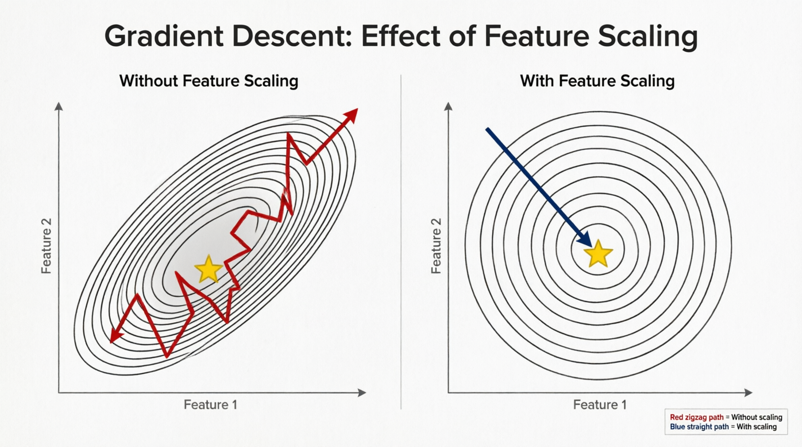

# Linear Models (Линейные модели)

Линейные модели — это рабочие лошадки продакшена. Они не такие модные, как бустинги, но в правильных местах дают 95% качества при 5% затрат ресурсов.

## Что такое линейная модель (на пальцах для инженера)

Формула

```
prediction = w1*x1 + w2*x2 + ... + wn*xn + bias
```

* x1...xn — признаки (числовые)
* w1...wn — веса (обучаемые параметры)
* bias — сдвиг (константа)

Модель "проводит прямую линию" (в многомерном пространстве — гиперплоскость), которая разделяет классы или предсказывает число.

Предсказание — это просто сумма произведений. Никаких деревьев, ветвлений, рекурсий. Это значит:

* Скорость: O(n) операций, где n — число признаков.
* Память: храним только массив весов (размер = n+1).
* Предсказуемость: всегда одинаковое время выполнения.

## Какие бывают линейные модели (важные для продакшена)

В `sklearn.linear_model` десяток моделей, но инженеру нужно знать 4:

| Модель | Задача | Особенность |
|--|--|--|
| LinearRegression | Регрессия (число) | Самый простой, но не устойчив к выбросам |
| Ridge | Регрессия | L2-регуляризация (штраф за большие веса) |
| Lasso | Регрессия | L1-регуляризация (обнуляет неважные признаки) |
| LogisticRegression | Классификация | Предсказывает вероятность класса (через сигмоиду) |

Для классификации ещё есть *SGDClassifier* (стохастический градиентный спуск) — позволяет обучать на данных, которые не влезают в память.

## Главное для инженера: как работают веса

В отличие от деревьев, где можно посмотреть на важность признаков, линейные модели дают веса со знаком:

```py
# После обучения
for name, coef in zip(feature_names, model.coef_):
    print(f"{name}: {coef:.3f}")
```

Пример вывода для кредитного скоринга:
```
age: 0.152      # чем старше, тем выше вероятность одобрения
income: 0.834   # самый сильный положительный фактор
debt: -0.421    # долги снижают вероятность
late_payments: -0.923  # просрочки очень сильно бьют
```

Что это даёт:

* Интерпретируемость: бизнес может объяснить клиенту, почему отказано.
* Отладка: если вес вдруг стал отрицательным там, где должен быть положительным — ищи баг в данных.
* Мониторинг дрифта: если веса модели начинают "плыть" при переобучении, это видно.

## Когда линейные модели побеждают бустинг

| Сценарий | Почему линейная модель лучше |
|--|--|
| Очень много признаков (тысячи/миллионы) | Бустинг переобучится или будет работать часами. Линейная модель — O(n) признаков, быстрая регуляризация (Lasso обнулит лишние) |
| Каждый миллисекунда на счету (HFT, рекомендации в real-time) | Линейная модель — 5-10 микросекунд на предсказание. Бустинг — 50-200 микросекунд (но всё равно быстро) |
| Мало данных (сотни/тысячи строк) | Бустинг переобучится, линейная модель с регуляризацией обобщит лучше |
| Нужно объяснить предсказание (кредитный скоринг, медицинская диагностика) | Веса понятны бизнесу. SHAP для бустинга сложнее |
| Инференс на слабом железе (мобильные устройства, IoT) | Линейная модель весит килобайты, работает без зависимостей |

**Главный миф, который нужно развенчать**: "Линейные модели работают плохо". Работают они отлично, если признаки хорошо подобраны. А если добавить полиномиальные признаки (x1^2, x1*x2), то линейная модель может улавливать нелинейности.

## Как готовить признаки для линейных моделей

Линейные модели ненавидят сырые данные. В отличие от деревьев, они не умеют сами находить пороги и взаимодействия.

Обязательные шаги предобработки:
```py
from sklearn.pipeline import Pipeline
from sklearn.preprocessing import StandardScaler, OneHotEncoder
from sklearn.compose import ColumnTransformer

# 1. Числовые признаки: обязательно масштабировать!
# Без этого вес признака "возраст" (значения 0-100) будет искусственно меньше веса признака "доход" (значения 10000-1000000)

# 2. Категориальные: one-hot encoding (но осторожно, множит признаки)

preprocessor = ColumnTransformer([
    ('num', StandardScaler(), ['age', 'income', 'debt']),
    ('cat', OneHotEncoder(drop='first'), ['city', 'job_type'])
])

model = Pipeline([
    ('preprocess', preprocessor),
    ('classifier', LogisticRegression(C=1.0))  # C — обратная регуляризация
])
```

Что будет, если не масштабировать:
* Градиентный спуск будет сходиться очень долго (буквально зигзагами).
* Регуляризация (L1/L2) будет неправильно штрафовать: признаки с большими значениями получат маленькие веса, но это не значит, что они важны.

### Масштабирование числовых признаков

Проблема на конкретном примере.
Представь модель кредитного скоринга с двумя признаками:
* Возраст: от 18 до 100 лет
* Доход: от 20 000 до 10 000 000 рублей

```py
import numpy as np
from sklearn.linear_model import LogisticRegression

# Данные: [возраст, доход]
X_train = np.array([
    [25, 50000],   # молодой, низкий доход
    [50, 200000],  # средний возраст, средний доход
    [40, 1000000], # средний возраст, высокий доход
    [60, 300000],  # пожилой, средний доход
])
y_train = np.array([0, 0, 1, 1])  # 0 - отказ, 1 - одобрение

model = LogisticRegression()
model.fit(X_train, y_train)

print("Веса:", model.coef_[0])
print("Смещение:", model.intercept_[0])
```

```
Веса: [0.023, 0.0000012]
Смещение: -1.2
```

**Проблема**: Вес дохода = 0.0000012 выглядит крошечным, а веса возраста = 0.023 — в 20 000 раз больше. Это НЕ значит, что возраст в 20 000 раз важнее! Это просто потому что доход измеряется в других единицах.

Почему это плохо?
1. Неправильная регуляризация (L1/L2 штрафует веса)
    * Вес дохода и так маленький, регуляризация его ещё сильнее занулит
    * Возраст получит большой штраф, хотя его масштаб объективно больше
2. Медленная сходимость градиентного спуска
    * Градиент будет "зигзагами" идти к оптимуму
    * Нужно больше итераций (медленное обучение)
3. Некорректная интерпретация
    * Бизнес скажет: "Почему у дохода вес почти ноль? Он же важен!"
    * А на самом деле важность нужно смотреть после масштабирования

## Что такое градиентный спуск

**Аналогия: спуск с горы в тумане**
Представь, что тебя ночью высадили на вершине горы в густом тумане. Тебе нужно спуститься в долину (найти минимум ошибки модели). Но ты не видишь дорогу — только чувствуешь наклон под ногами в каждой точке.

Правила спуска:
* Поставь ногу туда, где склон самый крутой (направление анти-градиента)
* Сделай шаг (размер шага — learning rate)
* Повторяй, пока не окажешься на дне (ошибка перестанет уменьшаться)

Это и есть градиентный спуск — итеративный алгоритм поиска минимума функции.

**В мире ML (линейная регрессия)**
У нас есть:
* Функция потерь (Loss) — показывает, насколько модель ошибается (например, MSE)
* Вес модели (w) — то, что мы учим
* Градиент — производная функции потерь по весу (показывает, в какую сторону круче)

```py
# Упрощённая идея
for i in range(1000):  # итерации обучения
    error = compute_loss(X, y, w)  # текущая ошибка
    gradient = compute_gradient(X, y, w)  # направление крутизны
    w = w - learning_rate * gradient  # шаг в сторону уменьшения ошибки
```

| Параметр | Аналогия
|--|--
| Функция потерь | Рельеф горы
| Веса модели | Координаты на карте
| Градиент | Направление крутизны склона
| Шаг обучения (learning rate) | Длина шага

## Почему градиент идёт "зигзагами" — визуализация

Проблема: неправильный масштаб признаков

Пример с кредитным скорингом:
* Признак 1 (возраст): значения 0-100
* Признак 2 (доход): значения 0-10 млн

Без масштабирования поверхность ошибки выглядит как глубокий овраг:

```
Ошибка
   ↑
   |                   ╱╲
   |                  ╱  ╲
   |                 ╱    ╲
   |                ╱      ╲
   |               ╱   ДНО  ╲
   |              ╱          ╲
   |             ╱            ╲
   |            ╱              ╲
   |           ╱                ╲
   +────────────────────────────────→ Вес дохода (ось X)
            (очень пологая)
```

Что происходит при градиентном спуске:

```
Вес дохода
    ↑
    |  *  ← Старт
    |   *  ← шаг 1
    |     *  ← шаг 2 (перелёт)
    |       *  ← шаг 3
    |         *  ← шаг 4 (перелёт)
    |           *  ← шаг 5
    |             *  ← ...
    +────────────────────────────────→ Вес возраста
                  (очень крутая)
```

Реальный паттерн "зигзаг"

```
Шаг 1: * →→→→→→→→→→→ (сильно в сторону возраста)
Шаг 2:     * ←←←←←←←← (перелёт в сторону дохода)
Шаг 3:        * →→→→→ (снова в сторону возраста)
Шаг 4:           * ←← (и так далее)
```

**Почему так происходит?**
* По оси возраста (крутой склон) — градиент огромный, шаг получается большим
* По оси дохода (пологий склон) — градиент маленький, шаг крошечный
* Алгоритм "мечется", не может найти прямой путь к дну

**После масштабирования поверхность становится круглой чашей:**



Слева: Без масштабирования (Without Feature Scaling)
* Контуры функции потерь: Вытянутые эллипсы. Это происходит, когда признаки имеют разный масштаб (например, `x1` от 0 до 1, а `x2` от 0 до 1000). Функция потерь становится очень чувствительной к изменениям одного признака и слабо реагирует на другой.
* Траектория (красная линия): Алгоритм движется "зигзагом". Градиент указывает в сторону наискорейшего спуска локально, но из-за разной кривизны по осям он постоянно "перепрыгив" через овраг.
* Результат: Сходимость очень медленная, требуется гораздо больше итераций для достижения минимума.

Справа: С масштабированием (With Feature Scaling)
* Контуры функции потерь: Окружности или симметричные эллипсы. После нормализации (например, StandardScaler или MinMax) все признаки имеют сопоставимый диапазон значений.
* Траектория (синяя линия): Прямой и эффективный путь к глобальному минимуму. Градиент указывает практически прямо на цель.
* Результат: Алгоритм сходится быстро, часто за меньшее количество шагов (эпох).

## Масштабирование признаков

### 1.StandardScaler (Z-score normalization)

Приводит признаки к распределению с `mean=0`, `std=1`.

```py
from sklearn.preprocessing import StandardScaler
import numpy as np

# Пример данных
X = np.array([
    [25, 1500000],
    [45, 3500000],
    [35, 2800000],
])

scaler = StandardScaler()
X_scaled = scaler.fit_transform(X)

print("После масштабирования:")
print(f"Возраст: mean={X_scaled[:, 0].mean():.2f}, std={X_scaled[:, 0].std():.2f}")
print(f"Доход: mean={X_scaled[:, 1].mean():.2f}, std={X_scaled[:, 1].std():.2f}")
```

### 2.MinMaxScaler (приведение к [0, 1])

Хорошо, когда знаете точные границы признаков.
```py
from sklearn.preprocessing import MinMaxScaler

scaler = MinMaxScaler(feature_range=(0, 1))
X_scaled = scaler.fit_transform(X)
# Возраст 25 → ~0.25, Доход 1.5М → ~0.15
```

### 3.RobustScaler (устойчив к выбросам)
Если в доходах есть экстремальные выбросы (например, 100 млн).

```py
from sklearn.preprocessing import RobustScaler

scaler = RobustScaler()  # использует медиану и интерквартильный размах
X_scaled = scaler.fit_transform(X)
```

## Пример полного пайплайна (логистическая регрессия)

```py
from sklearn.linear_model import LogisticRegression
from sklearn.preprocessing import StandardScaler
from sklearn.model_selection import train_test_split
import joblib

# Данные
X = np.array([[25, 1500000], [45, 3500000], [35, 2800000]])
y = np.array([0, 1, 0, ...])  # 0 = отказ, 1 = одобрение

# Разделение
X_train, X_test, y_train, y_test = train_test_split(X, y, test_size=0.2)

# Масштабирование
scaler = StandardScaler()
X_train_scaled = scaler.fit_transform(X_train)
X_test_scaled = scaler.transform(X_test)

# Обучение модели
model = LogisticRegression()
model.fit(X_train_scaled, y_train)

# Прогноз
preds = model.predict(X_test_scaled)

# Сохранение
joblib.dump({'scaler': scaler, 'model': model}, 'credit_model.pkl')
```
