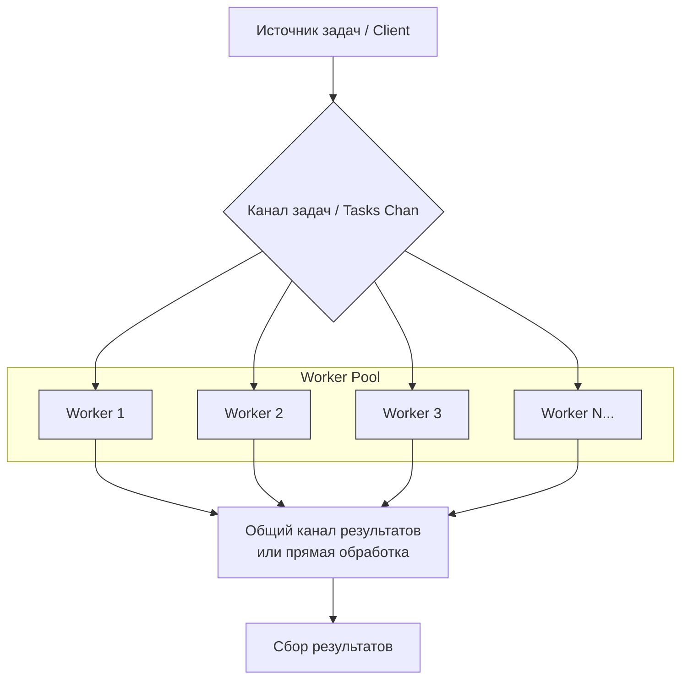
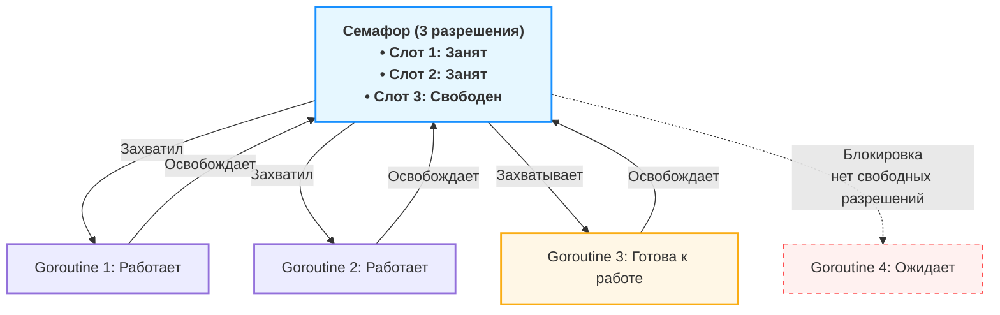

# Concurrency patterns (Основные паттерны конкурентности в Go)

## Worker Pool (пул воркеров)

### Проблемы которые можно решить этим паттерном:
1. Если твой сервис делает 1000 запросов в секунду к базе данных, а она выдерживает только 100, пул воркеров защитит БД от падения.
2. При внезапном всплеске трафика `go func()` на каждый запрос может создать 100500 горутин и съесть всю память. Пул ограничивает параллелизм.
3. Если у тебя есть пул соединений к сокету или файловых дескрипторов, пул воркеров гарантирует, что ты не превысишь лимит ОС.

**Суть**: Мы создаем фиксированное количество горутин (воркеров), которые заранее запущены и ждут работы. Основная горутина (диспетчер) ставит задачи в канал (очередь задач). Воркеры конкурентно забирают эти задачи из канала и выполняют их. Результаты они могут отправлять обратно в другой канал.

**Ключевая идея**: Ограничение количества одновременно выполняемых операций и повторное использование горутин.

*Воркер берет задачу, выполняет её и забывает. Он не хранит состояние между задачами.*



### Отличие Worker Pool от других паттернов:

1. **Горутины `go func()`:**

* Минусы против Worker Pool: Неконтролируемый рост числа горутин может привести к истощению ресурсов (память, файловые дескрипторы) и панике. Нет контроля над параллелизмом.
* Плюсы против Worker Pool: Проще в написании, ниже задержка на старте (не нужно ждать свободного воркера).
* Когда использовать: Для обработки сигналов, очень легких задач или когда нагрузка гарантированно мала.

2. **Pipeline (Конвейер):**
* Чем отличается: Это последовательная обработка. Данные проходят через цепочку стадий, где каждая стадия выполняется своей горутиной (или пулом), соединенных каналами.
* Пример: `stage1 (generate) -> stage2 (multiply) -> stage3 (save)`
* Минусы против Worker Pool: Сложнее отменять и обрабатывать ошибки, зависит от скорости самого медленного этапа.
* Плюсы против Worker Pool: Идеально для задач, которые можно разбить на четкие, независимые шаги обработки.

3. **Semaphore (Семафор):**

* Чем отличается: Семафор — это примитив синхронизации для ограничения доступа к ресурсу. Вы по-прежнему запускаете горутины на каждую задачу, но перед началом "тяжелой" части они захватывают слот семафора.

* Как это соотносится: Worker Pool часто реализуют через семафор, но семафор — это более низкоуровневый инструмент.

* Если задача тяжелая (HTTP запрос, сложный расчет, работа с диском) и их не миллионы — бери **Semaphore**. Оверхед на создание горутины ничтожен по сравнению с временем выполнения задачи. (Параллельный скрапинг 50 сайтов)

* Если задача очень легкая (парсинг строки, простое преобразование) и их поток бесконечный — бери **Worker Pool**. Иначе GC захлебнется от создания тысяч горутин. (Обработка логов в реальном времени, обработка событий из Kafka)

4. **MapReduce:**
* Чем отличается: Более высокоуровневый паттерн для распределенных вычислений. Он подразумевает фазу "Map" (распараллеливание) и фазу "Reduce" (свертка/агрегация). Worker Pool часто используется как реализация для фазы "Map".

* Минусы против Worker Pool: Избыточен для простой конкурентной обработки.

### Пример:
```go
package main

import (
    "fmt"
    "sync"
    "time"
)

func worker(id int, wg *sync.WaitGroup, jobs <-chan int) {
    defer wg.Done()
    defer func() {
        if r := recover(); r != nil {
            fmt.Printf("Worker %d: panic: %v\n", id, r)
        }
    }()

    for job := range jobs {
        fmt.Printf("Worker %d started the task %d\n", id, job)
        time.Sleep(time.Second) // Simulating a task
        fmt.Printf("Worker %d completed the task %d\n", id, job)
    }
}

func main() {
    const numJobs = 10
    const numWorkers = 3
    jobs := make(chan int, numJobs)
    var wg sync.WaitGroup

    for w := 1; w <= numWorkers; w++ {
        wg.Add(1)
        go worker(w, &wg, jobs)
    }

    for j := 1; j <= numJobs; j++ {
        jobs <- j
    }
    close(jobs)
    wg.Wait()
    fmt.Println("All tasks completed")
}
```

## Семафор (Semaphore) 

### Проблемы которые можно решить этим паттерном:

1. Внешний API позволяет только 5 одновременных запросов. Больше — банит по IP.
2. У вас пул соединений с БД из 10 штук. Если создать 100 горутин, каждая попытается взять соединение — 90 будут ждать и тратить память.
3. Микросервис падает под нагрузкой. Нужно ограничить количество одновременных запросов к нему, а при превышении лимита — быстро возвращать ошибку, не нагружая сервис.

**Суть**: Механизм синхронизации, который использует счетчик для ограничения количества одновременно выполняющихся операций или доступа к ресурсу. Горутины "захватывают" семафор перед началом работы и "освобождают" после завершения, а семафор блокирует новые захваты, когда счетчик достигает нуля.

**Ключевая идея**: Счётчик разрешений, который блокирует выполнение, когда лимит исчерпан, и пропускает, когда есть свободные слоты.



**Используйте официальный пакет `golang.org/x/sync/semaphore` кроме случаев когда нужно комбинация с другими паттернами на каналах или необходимо специфическое поведение.**

```go
// Семафор = буферизованный канал с пустыми структурами
sem := make(chan struct{}, N)

sem <- struct{}{} // Acquire: взять разрешение (блокирует если полный)
<-sem             // Release: вернуть разрешение
```

### Минусы семафора:

1. Отсутствие приоритетов. Семафор не гарантирует порядок доступа (FIFO)

2. Риск дедлока. Нужен careful defer.

3. Нет владения. В отличие от мьютекса, семафор может быть освобожден любой горутиной, не только той, которая захватила

### Отличие Семафора от других паттернов:

1. **Worker Pool**

* Worker Pool: Управляет горутинами, выполняющими задачи. Воркеры живут постоянно.

* Семафор: Управляет доступами к ресурсу. Горутины создаются под каждую задачу, но блокируются семафором перед "тяжелой" операцией.

* Ключевое отличие: Семафор не создает горутины, он только ограничивает их одновременное выполнение.

2. **Мьютекса (sync.Mutex)**

* Мьютекс: Бинарный (0 или 1), защищает критическую секцию от одновременного доступа.

* Семафор: Может быть счетным (N > 1), управляет количеством одновременных доступов.

* Ключевое отличие: Мьютекс — для взаимного исключения, семафор — для ограничения параллелизма.


3. **Rate Limiter**

* Rate Limiter: Ограничивает количество операций в единицу времени (например, 100/сек).

* Семафор: Ограничивает количество одновременных операций (например, 10 конкурентных запросов).

* Ключевое отличие: Rate limiter работает с временным окном, семафор — с параллелизмом.

4. **От каналов**

* Каналы: Передают данные между горутинами, могут использоваться как семафоры.

* Семафор: Специализированный примитив только для синхронизации, без передачи данных.

* Ключевое отличие: Семафор легче и быстрее для чистого ограничения доступа.

### Пример:
```go
package main

import (
	"fmt"
	"sync"
	"time"
)

// Semaphore - ограничитель конкурентности
type Semaphore struct {
	ch chan struct{}
}

func NewSemaphore(maxConcurrent int) *Semaphore {
	return &Semaphore{
		ch: make(chan struct{}, maxConcurrent),
	}
}

// Acquire - получаем разрешение (блокирует если лимит исчерпан)
func (s *Semaphore) Acquire() {
	s.ch <- struct{}{} // Отправка блокируется при заполнении канала
}

// Release - возвращаем разрешение в пул
func (s *Semaphore) Release() {
	<-s.ch // Освобождаем слот
}

func worker(id int, sem *Semaphore, wg *sync.WaitGroup) {
	defer wg.Done()

	sem.Acquire()       // Ждём свободный слот
	defer sem.Release() // Освобождаем после работы

	fmt.Printf("[%s] Worker %d: начал работу\n", time.Now().Format("15:04:05"), id)
	time.Sleep(2 * time.Second) // Имитация работы
	fmt.Printf("[%s] Worker %d: завершил\n", time.Now().Format("15:04:05"), id)
}

func main() {
	sem := NewSemaphore(3) // Максимум 3 одновременных задачи
	var wg sync.WaitGroup

	// Запускаем 10 горутин, но активными будут только 3
	for i := 1; i <= 10; i++ {
		wg.Add(1)
		go worker(i, sem, &wg)
		time.Sleep(200 * time.Millisecond) // Небольшая задержка между запусками
	}

	wg.Wait()
	fmt.Println("Все задачи выполнены")
}
```