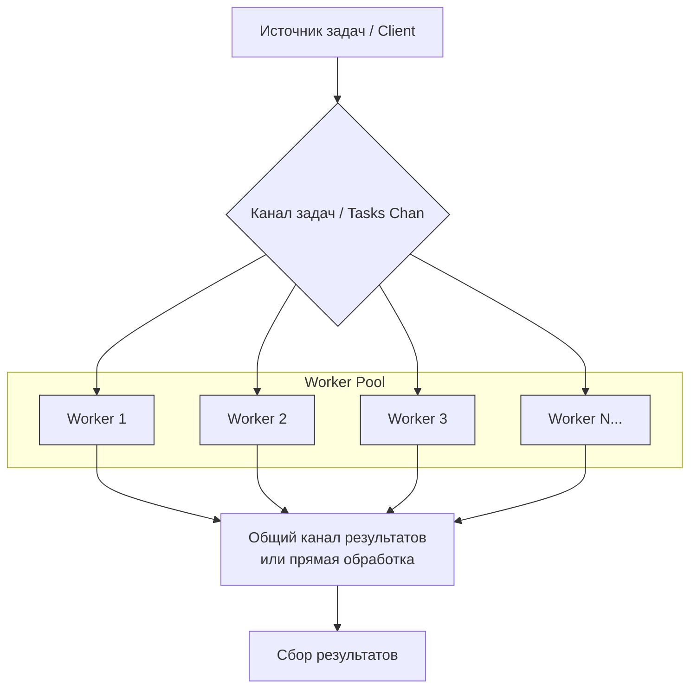
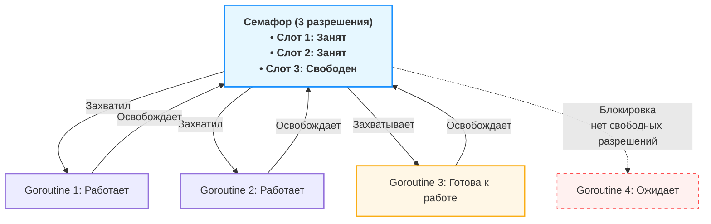
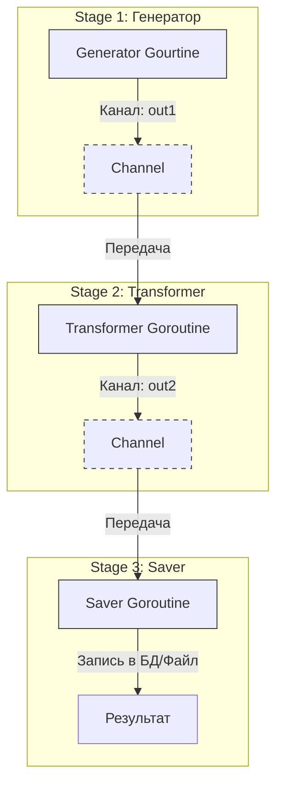
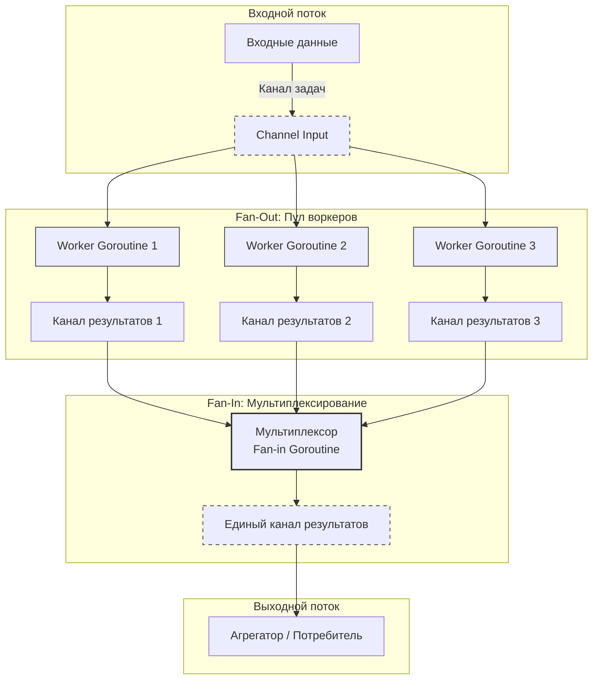
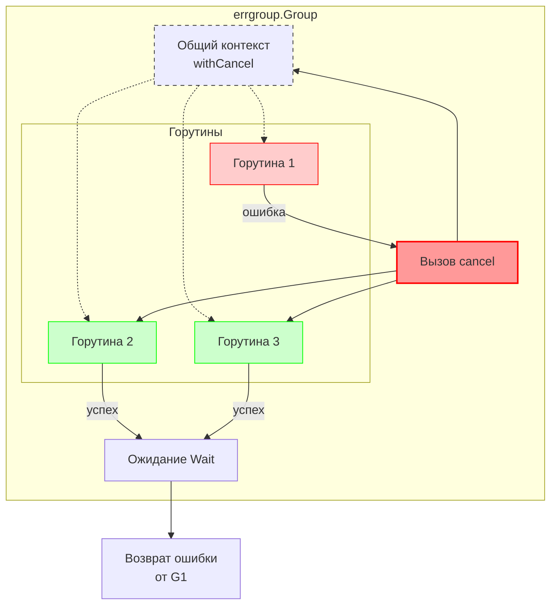
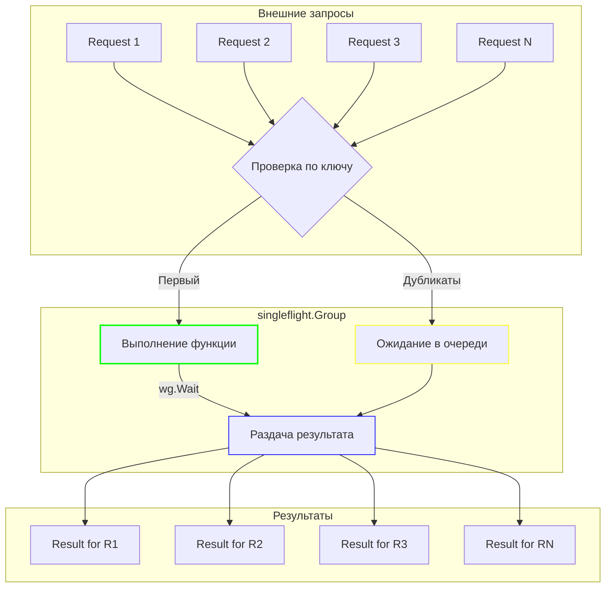

# Concurrency patterns (Основные паттерны конкурентности в Go)

## Worker Pool (пул воркеров)

### Проблемы которые можно решить этим паттерном:
1. Если твой сервис делает 1000 запросов в секунду к базе данных, а она выдерживает только 100, пул воркеров защитит БД от падения.
2. При внезапном всплеске трафика `go func()` на каждый запрос может создать 100500 горутин и съесть всю память. Пул ограничивает параллелизм.
3. Если у тебя есть пул соединений к сокету или файловых дескрипторов, пул воркеров гарантирует, что ты не превысишь лимит ОС.

**Суть**: Мы создаем фиксированное количество горутин (воркеров), которые заранее запущены и ждут работы. Основная горутина (диспетчер) ставит задачи в канал (очередь задач). Воркеры конкурентно забирают эти задачи из канала и выполняют их. Результаты они могут отправлять обратно в другой канал.

**Ключевая идея**: Ограничение количества одновременно выполняемых операций и повторное использование горутин.

*Воркер берет задачу, выполняет её и забывает. Он не хранит состояние между задачами.*



### Отличие Worker Pool от других паттернов:

1. **Горутины `go func()`:**

* Минусы против Worker Pool: Неконтролируемый рост числа горутин может привести к истощению ресурсов (память, файловые дескрипторы) и панике. Нет контроля над параллелизмом.
* Плюсы против Worker Pool: Проще в написании, ниже задержка на старте (не нужно ждать свободного воркера).
* Когда использовать: Для обработки сигналов, очень легких задач или когда нагрузка гарантированно мала.

2. **Pipeline (Конвейер):**
* Чем отличается: Это последовательная обработка. Данные проходят через цепочку стадий, где каждая стадия выполняется своей горутиной (или пулом), соединенных каналами.
* Пример: `stage1 (generate) -> stage2 (multiply) -> stage3 (save)`
* Минусы против Worker Pool: Сложнее отменять и обрабатывать ошибки, зависит от скорости самого медленного этапа.
* Плюсы против Worker Pool: Идеально для задач, которые можно разбить на четкие, независимые шаги обработки.

3. **Semaphore (Семафор):**

* Чем отличается: Семафор — это примитив синхронизации для ограничения доступа к ресурсу. Вы по-прежнему запускаете горутины на каждую задачу, но перед началом "тяжелой" части они захватывают слот семафора.

* Как это соотносится: Worker Pool часто реализуют через семафор, но семафор — это более низкоуровневый инструмент.

* Если задача тяжелая (HTTP запрос, сложный расчет, работа с диском) и их не миллионы — бери **Semaphore**. Оверхед на создание горутины ничтожен по сравнению с временем выполнения задачи. (Параллельный скрапинг 50 сайтов)

* Если задача очень легкая (парсинг строки, простое преобразование) и их поток бесконечный — бери **Worker Pool**. Иначе GC захлебнется от создания тысяч горутин. (Обработка логов в реальном времени, обработка событий из Kafka)

4. **MapReduce:**
* Чем отличается: Более высокоуровневый паттерн для распределенных вычислений. Он подразумевает фазу "Map" (распараллеливание) и фазу "Reduce" (свертка/агрегация). Worker Pool часто используется как реализация для фазы "Map".

* Минусы против Worker Pool: Избыточен для простой конкурентной обработки.

### Пример:
```go
package main

import (
    "fmt"
    "sync"
    "time"
)

func worker(id int, wg *sync.WaitGroup, jobs <-chan int) {
    defer wg.Done()
    defer func() {
        if r := recover(); r != nil {
            fmt.Printf("Worker %d: panic: %v\n", id, r)
        }
    }()

    for job := range jobs {
        fmt.Printf("Worker %d started the task %d\n", id, job)
        time.Sleep(time.Second) // Simulating a task
        fmt.Printf("Worker %d completed the task %d\n", id, job)
    }
}

func main() {
    const numJobs = 10
    const numWorkers = 3
    jobs := make(chan int, numJobs)
    var wg sync.WaitGroup

    for w := 1; w <= numWorkers; w++ {
        wg.Add(1)
        go worker(w, &wg, jobs)
    }

    for j := 1; j <= numJobs; j++ {
        jobs <- j
    }
    close(jobs)
    wg.Wait()
    fmt.Println("All tasks completed")
}
```

## Семафор (Semaphore) 

### Проблемы которые можно решить этим паттерном:

1. Внешний API позволяет только 5 одновременных запросов. Больше — банит по IP.
2. У вас пул соединений с БД из 10 штук. Если создать 100 горутин, каждая попытается взять соединение — 90 будут ждать и тратить память.
3. Микросервис падает под нагрузкой. Нужно ограничить количество одновременных запросов к нему, а при превышении лимита — быстро возвращать ошибку, не нагружая сервис.

**Суть**: Механизм синхронизации, который использует счетчик для ограничения количества одновременно выполняющихся операций или доступа к ресурсу. Горутины "захватывают" семафор перед началом работы и "освобождают" после завершения, а семафор блокирует новые захваты, когда счетчик достигает нуля.

**Ключевая идея**: Счётчик разрешений, который блокирует выполнение, когда лимит исчерпан, и пропускает, когда есть свободные слоты.



**Используйте официальный пакет `golang.org/x/sync/semaphore` кроме случаев когда нужно комбинация с другими паттернами на каналах или необходимо специфическое поведение.**

```go
// Семафор = буферизованный канал с пустыми структурами
sem := make(chan struct{}, N)

sem <- struct{}{} // Acquire: взять разрешение (блокирует если полный)
<-sem             // Release: вернуть разрешение
```

### Минусы семафора:

1. Отсутствие приоритетов. Семафор не гарантирует порядок доступа (FIFO)

2. Риск дедлока. Нужен careful defer.

3. Нет владения. В отличие от мьютекса, семафор может быть освобожден любой горутиной, не только той, которая захватила

### Отличие Семафора от других паттернов:

1. **Worker Pool**

* Worker Pool: Управляет горутинами, выполняющими задачи. Воркеры живут постоянно.

* Семафор: Управляет доступами к ресурсу. Горутины создаются под каждую задачу, но блокируются семафором перед "тяжелой" операцией.

* Ключевое отличие: Семафор не создает горутины, он только ограничивает их одновременное выполнение.

2. **Мьютекса (sync.Mutex)**

* Мьютекс: Бинарный (0 или 1), защищает критическую секцию от одновременного доступа.

* Семафор: Может быть счетным (N > 1), управляет количеством одновременных доступов.

* Ключевое отличие: Мьютекс — для взаимного исключения, семафор — для ограничения параллелизма.


3. **Rate Limiter**

* Rate Limiter: Ограничивает количество операций в единицу времени (например, 100/сек).

* Семафор: Ограничивает количество одновременных операций (например, 10 конкурентных запросов).

* Ключевое отличие: Rate limiter работает с временным окном, семафор — с параллелизмом.

4. **От каналов**

* Каналы: Передают данные между горутинами, могут использоваться как семафоры.

* Семафор: Специализированный примитив только для синхронизации, без передачи данных.

* Ключевое отличие: Семафор легче и быстрее для чистого ограничения доступа.

### Пример:
```go
package main

import (
	"fmt"
	"sync"
	"time"
)

// Semaphore - ограничитель конкурентности
type Semaphore struct {
	ch chan struct{}
}

func NewSemaphore(maxConcurrent int) *Semaphore {
	return &Semaphore{
		ch: make(chan struct{}, maxConcurrent),
	}
}

// Acquire - получаем разрешение (блокирует если лимит исчерпан)
func (s *Semaphore) Acquire() {
	s.ch <- struct{}{} // Отправка блокируется при заполнении канала
}

// Release - возвращаем разрешение в пул
func (s *Semaphore) Release() {
	<-s.ch // Освобождаем слот
}

func worker(id int, sem *Semaphore, wg *sync.WaitGroup) {
	defer wg.Done()

	sem.Acquire()       // Ждём свободный слот
	defer sem.Release() // Освобождаем после работы

	fmt.Printf("[%s] Worker %d: начал работу\n", time.Now().Format("15:04:05"), id)
	time.Sleep(2 * time.Second) // Имитация работы
	fmt.Printf("[%s] Worker %d: завершил\n", time.Now().Format("15:04:05"), id)
}

func main() {
	sem := NewSemaphore(3) // Максимум 3 одновременных задачи
	var wg sync.WaitGroup

	// Запускаем 10 горутин, но активными будут только 3
	for i := 1; i <= 10; i++ {
		wg.Add(1)
		go worker(i, sem, &wg)
		time.Sleep(200 * time.Millisecond) // Небольшая задержка между запусками
	}

	wg.Wait()
	fmt.Println("Все задачи выполнены")
}
```

## Pipeline (Конвейер обработки данных)

### Проблемы которые можно решить этим паттерном:

1. Когда нужно обработать миллионы записей (например, строк в логах, изображений или записей из БД), выполнение всех шагов последовательно для одного элемента за другим приводит к простою ресурсов. Процессор простаивает во время операций ввода-вывода (чтения с диска, сетевых запросов), а последующие шаги ждут завершения предыдущих.
2. Представьте функцию в 500 строк, которая: `read -> transform -> validate -> enrich -> save`. Её невозможно покрыть адекватными тестами, сложно расширять (добавление нового шага требует правки всей функции) и легко сломать, задев логику соседнего шага.
3. В многопоточных средах сложно корректно обработать ситуацию, когда на одном из этапов произошла фатальная ошибка. Нужно остановить все этапы, не допустить утечки горутин и корректно завершить программу.

**Суть**: Разбиение сложной операции обработки данных на последовательность независимых, переиспользуемых этапов (стадий), где каждый этап выполняет одну конкретную функцию, а данные передаются между ними по каналам.

**Ключевая идея**: Разделить обработку данных на последовательные, конкурентно выполняемые этапы, где выход одного этапа служит входом для следующего, используя каналы как конвейерную ленту для передачи данных и управления потоком.



### Отличие Pipeline от других паттернов

1. **Отличие от Chain of Responsibility (Цепочка обязанностей)**

* Pipeline: Каждый элемент обязательно проходит все этапы конвейера, и на каждом этапе трансформируется. Данные движутся в одном направлении. Это про обработку данных.

* Chain of Responsibility: Запрос передается по цепочке обработчиков, пока один из них не обработает запрос. Запрос не обязательно проходит всю цепочку. Это про передачу ответственности. (Пример: middleware в веб-фреймворках, где один обработчик может вернуть ответ и прервать цепочку).

2. **Отличие от Fan-Out / Fan-In**

* Pipeline: Это структурный паттерн организации кода.

* Fan-Out / Fan-In: Это паттерны параллелизации, которые часто используются внутри этапов Pipeline.
    - Fan-Out: Запуск нескольких горутин (воркеров) на одном этапе для распараллеливания тяжелой работы.
    - Fan-In: Сбор результатов от нескольких воркеров обратно в один канал.
    - Можно сказать, что Fan-Out/Fan-In — это способы реализации конкретного этапа Pipeline для повышения производительности.

3. Отличие от Observer (Наблюдатель)

* Pipeline: Push-модель. "Генератор" активно отправляет данные следующему этапу. Это однонаправленный поток.

* Observer: Один субъект уведомляет множество подписчиков об изменении своего состояния (one-to-many). Подписчики пассивны и ждут уведомлений. Это про рассылку событий, а не про трансформацию данных.

### Пример:

```go
package main

import "fmt"

// stage 1: Генератор
func gen(nums ...int) <-chan int {
    out := make(chan int)
    go func() {
        for _, n := range nums {
            out <- n
        }
        close(out)
    }()
    return out
}

// stage 2: Умножение на 2
func sq(in <-chan int) <-chan int {
    out := make(chan int)
    go func() {
        for n := range in {
            out <- n * n
        }
        close(out)
    }()
    return out
}

func main() {
    // Сборка конвейера
    in := gen(2, 3, 4)
    out := sq(in)

    // Результат
    for result := range out {
        fmt.Println(result) // 4, 9, 16
    }
}
```

## Fan-out / Fan-in

### Проблемы которые можно решить этим паттерном:

1. У вас есть 8 ядер, а ваш этап обработки данных выполняется последовательно в одной горутине. Процессор простаивает, а очередь задач растет. Мы создаем N воркеров (по числу ядер), которые разбирают задачи из общего канала параллельно, нагружая все доступные ядра.
2. Допустим, в вашем Pipeline есть этап, который ходит во внешний API или ресайзит изображения. Это медленно. Если оставить это в одном потоке, весь конвейер будет тормозить на этом этапе.
3. Вы запустили 100 горутин для парсинга веб-страниц. Как собрать все результаты в одном месте для финальной записи в БД, не используя глобальные переменные и мьютексы.
4. На каждый входящий запрос создавать новую горутину — опасно. При пиковой нагрузке это может положить сервис (паника из-за переполнения памяти).

**Суть**: Паттерн состоит из двух фаз, которые работают в тандеме для параллелизации задач.
1. **Fan-out (Разветвление)**: Процесс запуска нескольких горутин (воркеров) для чтения задач из одного входного канала. Это распределяет нагрузку.
2. **Fan-in (Сведение)**: Процесс объединения результатов работы нескольких горутин в один выходной канал. Это собирает данные воедино для финальной обработки.

**Ключевая идея**: Распараллелить выполнение однотипных задач путем распределения их между фиксированным пулом воркеров и последующей агрегации результатов через мультиплексирование выходных каналов.



### Отличие Fan-out / Fan-in от других паттернов

1. **Отличие от Pipeline**

* Fan-out/Fan-in: Это про горизонтальное масштабирование одного этапа. Мы берем один шаг и размножаем его исполнителей.

* Pipeline: Это про вертикальную декомпозицию процесса на разные шаги (чтение -> обработка -> запись). Fan-out/Fan-in часто живет внутри одного конкретного этапа Pipeline.

2. **Отличие от Worker Pool**

* На самом деле, это практически одно и то же. Fan-out/Fan-in — это концептуальное описание того, как устроен worker pool.

* Fan-out = диспетчеризация задач в пул. Fan-in = сбор результатов из пула. 
Можно сказать, что Fan-out/Fan-in — это архитектурный паттерн, а Worker Pool — его конкретная реализация для выполнения задач.

3. **Отличие от Pub/Sub (Publish-Subscribe)**

* Fan-out/Fan-in: Каждую задачу из входного канала получает только один воркер. Это распределение работы (конкуренция за задачи).

* Pub/Sub: Каждое сообщение получают все подписчики. Это широковещательная рассылка.

### Пример:

```go
package main

import (
    "context"
    "fmt"
    "sync"
)

// Генерация задач
func generateJobs(n int) <-chan int {
    ch := make(chan int)
    go func() {
	    for i := 1; i <= n; i++ {
            ch <- i
        }
        close(ch)
    }()
    return ch
}

// Fan-out: Распределение задач между воркерами
func fanOut(ctx context.Context, jobs <-chan int, numWorkers int) []<-chan int {
    workerChannels := make([]<-chan int, 0, numWorkers)

    for i := 0; i < numWorkers; i++ {
        resultCh := make(chan int)
		
        go func() {
            defer close(resultCh)
            for {
                select {
                case job, ok := <-jobs:
                    if !ok {
                        return // Канал задач закрыт
                    }
                    // Обработка задачи (пример: возведение в квадрат)
                    resultCh <- job * job
                case <-ctx.Done():
                    return // Отмена через контекст
                }
            }
        }()

        workerChannels = append(workerChannels, resultCh)
    }
    return workerChannels
}

// Fan-in: Объединение результатов
func fanIn(channels []<-chan int) <-chan int {
    var wg sync.WaitGroup
    merged := make(chan int)

    wg.Add(len(channels))
	
    for _, ch := range channels {
        go func(c <-chan int) {
            defer wg.Done()
            for res := range c {
                merged <- res
            }
        }(ch)
    }

    // Горутина для закрытия итогового канала
    go func() {
        wg.Wait()
        close(merged)
    }()

    return merged
}

func main() {
    // 1. Генерируем задачи
    jobs := generateJobs(5)

    // 2. Fan-out: распределяем задачи между 3 воркерами
    resultChannels := fanOut(context.Background(), jobs, 3)

    // 3. Fan-in: объединяем результаты из всех каналов
    mergedResults := fanIn(resultChannels)

    // 4. Результаты
    for res := range mergedResults {
        fmt.Printf("Получен результат: %d\n", res)
    }
}
```

## ErrGroup

### Проблемы которые можно решить этим паттерном:

1. Вы запустили 5 горутин. Вам нужно дождаться завершения всех, при этом если хотя бы одна упала с ошибкой — остановить остальные и вернуть ошибку. Реализация через `sync.WaitGroup + context + каналы для ошибок приводит к шаблонному коду, который легко сломать.
2. В классическом подходе, если одна горутина упала с ошибкой, остальные продолжают работу впустую или, что хуже, навечно блокируются на записи в канал, который никто не читает. Это утечка ресурсов.
3. Проблема сложного сбора ошибок от множества горутин. Нужно собрать все ошибки или хотя бы первую значимую. Ручная реализация требует создания мьютексов для защиты общей переменной ошибки или отдельных каналов.

**Суть**: ErrGroup — это менеджер группы горутин, который предоставляет два основных механизма:
1. **Синхронизация**: Ожидание завершения всех запущенных горутин (как sync.WaitGroup).

2. **Распространение ошибок и отмена**: При возникновении ошибки в любой из горутин автоматически отменяется общий контекст, сигнализируя остальным горутинам о необходимости завершиться, а метод Wait() возвращает эту ошибку.

**Ключевая идея**: Объединить запуск конкурентных задач, ожидание их завершения и автоматическую остановку всех при первой же ошибке через общий контекст.

**Используйте официальный пакет `golang.org/x/sync/errgroup`.**



### Отличие ErrGroup от других паттернов

1. **Отличие от sync.WaitGroup**

* sync.WaitGroup: Простой счетчик горутин. Ждет завершения всех, но не работает с ошибками и контекстом. Если горутина упала, остальные продолжают работу.

* ErrGroup: Надстройка над WaitGroup, добавляющая привязку к контексту и семантику "остановить всё при первой ошибке".

2. **Отличие от Pipeline**

* Pipeline: Паттерн организации последовательных этапов обработки данных, где данные текут по каналам.

* ErrGroup: Паттерн управления параллельными задачами, которые могут быть независимы или слабо связаны. Используется для координации, а не для трансформации потока данных.

3. **Отличие от Worker Pool (Fan-out/Fan-in)**

* Worker Pool: Про распределение задач между фиксированным числом воркеров для параллельной обработки.

* ErrGroup: Про координацию выполнения набора задач (часто разнородных) и реакцию на первую ошибку. ErrGroup может использоваться внутри воркера или для управления группой воркеров, но фокус на отмене, а не на распределении задач.

### Пример:

```go
package main

import (
    "context"
    "fmt"
    "time"
    
    "golang.org/x/sync/errgroup"
)

func main() {
    // Создаем errgroup с контекстом
    g, ctx := errgroup.WithContext(context.Background())
    
    // Запускаем горутину, которая успешно выполнится
    g.Go(func() error {
        select {
        case <-time.After(1 * time.Second):
            fmt.Println("Горутина 1: успех")
            return nil
        case <-ctx.Done():
            fmt.Println("Горутина 1: отменена")
            return ctx.Err()
        }
    })
    
    // Запускаем горутину, которая завершится ошибкой
    g.Go(func() error {
        select {
        case <-time.After(500 * time.Millisecond):
            fmt.Println("Горутина 2: ошибка!")
            return fmt.Errorf("что-то пошло не так в горутине 2")
        case <-ctx.Done():
            fmt.Println("Горутина 2: отменена")
            return ctx.Err()
        }
    })
    
    // Запускаем горутину, которая должна быть отменена
    g.Go(func() error {
        select {
        case <-time.After(3 * time.Second):
            fmt.Println("Горутина 3: успех (но этого не случится)")
            return nil
        case <-ctx.Done():
            fmt.Println("Горутина 3: отменена")
            return ctx.Err() // context.Canceled
        }
    })
    
    // Ждем завершения всех горутин и получаем первую ошибку
    if err := g.Wait(); err != nil {
        fmt.Printf("Ошибка: %v\n", err)
    } else {
        fmt.Println("Все успешно")
    }
    
    // Даем время увидеть вывод
    time.Sleep(1 * time.Second)
}
```

## Singleflight

### Проблемы которые можно решить этим паттерном:

1. Проблема "Thundering Herd" (Стадо бизонов). Представьте: кэш с данными пользователя истек. Приходит 100 одновременных запросов, все видят отсутствие кэша и одновременно ломятся в базу данных. База падает под нагрузкой, сервис умирает
2. Микросервис ходит во внешнее API с жесткими лимитами на количество запросов. При высокой нагрузке 10 параллельных запросов с одним и тем же ключом могут исчерпать лимит или просто создать избыточный трафик. (Все запросы с одинаковым ключом объединяются в один внешний вызов, экономя лимиты и ресурсы.)
3. Тяжелые операции: парсинг веб-страниц через headless браузер, генерация PDF-отчетов, ML-инференс. Если 50 пользователей запросят один и тот же отчет, запускать 50 браузеров — самоубийство для памяти. (Будет запущен один браузер, результат получат все.)

**Суть**: Singleflight гарантирует, что для заданного ключа одновременно выполняется только одна операция. Все остальные вызовы с тем же ключом не запускают новую операцию, а "подключаются" к уже выполняющейся и ждут её результата. После завершения оригинального вызова все ожидающие получают один и тот же результат (или ошибку)

**Ключевая идея**: Объединить множество конкурентных запросов с одинаковым ключом в один реальный вызов и раздать результат всем ожидающим.

**Используйте официальный пакет `golang.org/x/sync/singleflight`.**



### Отличие Singleflight от других паттернов

1. **Отличие от кэширования.**

* Кэш: Хранит результат после выполнения. При параллельном обращении к пустому кэшу все запросы всё равно пойдут в БД (cache miss).

* Singleflight: Не хранит результат, а объединяет запросы в моменте. После завершения результат не сохраняется (если вы сами не положите его в кэш) .

2. **Отличие от семафора (worker pool).**

* Семафор: Ограничивает количество одновременно выполняемых операций, но не объединяет одинаковые. 10 запросов к одному ключу могут выполняться параллельно (если пул позволяет).

* Singleflight: Независимо от размера пула, для одного ключа всегда выполняется только одна операция .

3. **Отличие от WaitGroup.**

* WaitGroup: Просто ждет завершения группы горутин, но не управляет дубликатами и не делится результатами.

* Singleflight: Использует WaitGroup внутри себя для координации ожидающих горутин и раздачи результата .

4. **Отличие от Mutex.**

* Mutex: Блокирует доступ к критической секции, но каждый раз, когда мьютекс освобождается, новый поток заходит и повторяет операцию.

* Singleflight: Операция выполняется один раз, результат отдается всем.

### Пример:

```go
package main

import (
    "fmt"
    "sync"
    "time"

    "golang.org/x/sync/singleflight"
)

func main() {
    var group singleflight.Group
    var wg sync.WaitGroup

    key := "user:123"
    requests := 5

    // Симулируем тяжелую операцию (поход в БД или внешнее API)
    expensiveOp := func() (interface{}, error) {
        fmt.Println("Тяжелая операция началась (реально один раз)")
        time.Sleep(2 * time.Second) // имитация долгой работы
        fmt.Println("Тяжелая операция завершилась")
        return "data_for_" + key, nil
    }

    // Запускаем 5 конкурентных запросов
    for i := 0; i < requests; i++ {
        wg.Add(1)
        go func(reqID int) {
            defer wg.Done()

            // Выполняем через singleflight
            result, err, shared := group.Do(key, expensiveOp)

            if err != nil {
                fmt.Printf("Запрос %d: ошибка %v\n", reqID, err)
                return
            }
            fmt.Printf("Запрос %d: результат = %v (shared = %v)\n",
                reqID, result, shared)
        }(i)
    }

    wg.Wait()
}
```

## Or-Channel

### Проблемы которые можно решить этим паттерном:

1. Вы отправили один и тот же запрос к трём разным API-серверам (для отказоустойчивости или скорости). Нужно дождаться самого быстрого ответа и сразу отменить остальные запросы, чтобы не тратить ресурсы.
2. У вас есть несколько причин для завершения работы: сигнал SIGINT от пользователя, таймаут операции, ошибка в другой части системы. Нужно ждать любого из этих событий, но писать `select` с 10 case'ами — негибко и невозможно, если количество каналов неизвестно заранее.
3. В сложных системах существуют деревья горутин. Ручная передача сигналов отмены через всю иерархию приводит к разрастанию кода и утечкам, если какой-то уровень не обработал сигнал.

**Суть**: Функция `or` принимает на вход вариативный список каналов (обычно `<-chan interface{}`) и возвращает один объединённый канал. Этот результирующий канал закрывается, как только закрывается любой из входных каналов. Если входных каналов нет, возвращается `nil`.

**Ключевая идея**: Объединить любое количество done-каналов в один, который сигнализирует о завершении при срабатывании первого из них, используя рекурсию для построения дерева ожидания.

### Отличие Or-Channel от других паттернов

1. **Отличие от Fan-In.**

* Fan-In: Собирает данные из нескольких каналов в один. Все каналы читаются, все данные доставляются .

* Or-Channel: Собирает сигналы (события закрытия). Важен только факт, что первый из каналов закрылся; остальные игнорируются.

2. **Отличие от Context.WithCancel.**

* Context: Предоставляет механизм отмены через иерархию контекстов, но требует явного создания родительско-дочерних связей при старте.

* Or-Channel: Позволяет динамически объединить уже существующие независимые done-каналы (или контексты через `ctx.Done()`) без необходимости знать о них заранее.

3. **Отличие от Select с динамическими case (reflect.Select).**

* Select + reflect: Альтернативная реализация той же идеи, но через рефлексию. Она проще для понимания, но медленнее и считается менее идиоматичной для Go .

* Or-Channel (рекурсивный): Более производительный и идиоматичный способ, хотя и сложнее для восприятия из-за рекурсии.

### Пример:

```go
package main

import (
    "fmt"
    "time"
)

func main() {
    // or — функция, объединяющая каналы
    var or func(channels ...<-chan interface{}) <-chan interface{}

    or = func(channels ...<-chan interface{}) <-chan interface{} {
        // Базовые случаи рекурсии
        switch len(channels) {
        case 0:
            return nil
        case 1:
            return channels[0]
        }

        // Создаём объединённый канал для этого уровня
        orDone := make(chan interface{})
		
        // Запускаем горутину, которая будет ждать первый сигнал
        go func() {
            defer close(orDone)

            switch len(channels) {
            case 2:
                // Для двух каналов — простой select
                select {
                case <-channels[0]:
                case <-channels[1]:
                }
            default:
                // Для трёх и более — слушаем первые три напрямую,
                // а для остальных запускаем рекурсию
                select {
                case <-channels[0]:
                case <-channels[1]:
                case <-channels[2]:
                case <-or(append(channels[3:], orDone)...):
                }
            }
        }()

        return orDone
    }
	
    // sig создаёт канал, который закроется через заданное время
    sig := func(after time.Duration) <-chan interface{} {
        c := make(chan interface{})
        go func() {
            defer close(c)
            time.Sleep(after)
        }()
        return c
    }

    // Засекаем время
    start := time.Now()

    // Объединяем 5 каналов с разными временами ожидания
    <-or(
        sig(2*time.Hour),   // закроется через 2 часа
        sig(5*time.Minute), // через 5 минут
        sig(1*time.Second), // через 1 секунду (самый быстрый!)
        sig(1*time.Hour),   // через 1 час
        sig(1*time.Minute), // через 1 минуту
    )

    // Программа завершится через ~1 секунду, несмотря на остальные каналы
    fmt.Printf("Done after %v\n", time.Since(start))
}
```
