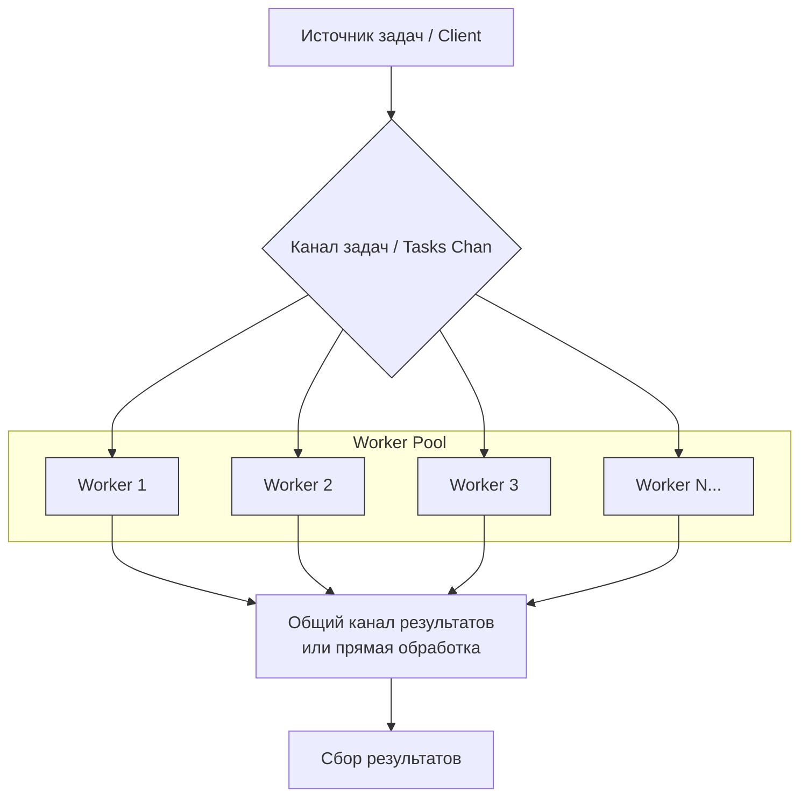

# Concurrency patterns (Основные паттерны конкурентности в Go)

## Worker Pool (пул воркеров)

### Проблемы которые можно решить этим паттерном:
1. Если твой сервис делает 1000 запросов в секунду к базе данных, а она выдерживает только 100, пул воркеров защитит БД от падения.
2. При внезапном всплеске трафика `go func()` на каждый запрос может создать 100500 горутин и съесть всю память. Пул ограничивает параллелизм.
3. Если у тебя есть пул соединений к сокету или файловых дескрипторов, пул воркеров гарантирует, что ты не превысишь лимит ОС.

**Суть**: Мы создаем фиксированное количество горутин (воркеров), которые заранее запущены и ждут работы. Основная горутина (диспетчер) ставит задачи в канал (очередь задач). Воркеры конкурентно забирают эти задачи из канала и выполняют их. Результаты они могут отправлять обратно в другой канал.

**Ключевая идея**: Ограничение количества одновременно выполняемых операций и повторное использование горутин.

*Воркер берет задачу, выполняет её и забывает. Он не хранит состояние между задачами.*



### Отличие Worker Pool от других подходов:

1. **Горутины `go func()`:**

* Минусы против Worker Pool: Неконтролируемый рост числа горутин может привести к истощению ресурсов (память, файловые дескрипторы) и панике. Нет контроля над параллелизмом.
* Плюсы против Worker Pool: Проще в написании, ниже задержка на старте (не нужно ждать свободного воркера).
* Когда использовать: Для обработки сигналов, очень легких задач или когда нагрузка гарантированно мала.

2. **Pipeline (Конвейер):**
* Чем отличается: Это последовательная обработка. Данные проходят через цепочку стадий, где каждая стадия выполняется своей горутиной (или пулом), соединенных каналами.
* Пример: `stage1 (generate) -> stage2 (multiply) -> stage3 (save)`
* Минусы против Worker Pool: Сложнее отменять и обрабатывать ошибки, зависит от скорости самого медленного этапа.
* Плюсы против Worker Pool: Идеально для задач, которые можно разбить на четкие, независимые шаги обработки.

3. **Semaphore (Семафор):**

* Чем отличается: Семафор — это примитив синхронизации для ограничения доступа к ресурсу. Вы по-прежнему запускаете горутины на каждую задачу, но перед началом "тяжелой" части они захватывают слот семафора.

* Как это соотносится: Worker Pool часто реализуют через семафор, но семафор — это более низкоуровневый инструмент.

* Если задача тяжелая (HTTP запрос, сложный расчет, работа с диском) и их не миллионы — бери **Semaphore**. Оверхед на создание горутины ничтожен по сравнению с временем выполнения задачи. (Параллельный скрапинг 50 сайтов)

* Если задача очень легкая (парсинг строки, простое преобразование) и их поток бесконечный — бери **Worker Pool**. Иначе GC захлебнется от создания тысяч горутин. (Обработка логов в реальном времени, обработка событий из Kafka)

4. **MapReduce:**
* Чем отличается: Более высокоуровневый паттерн для распределенных вычислений. Он подразумевает фазу "Map" (распараллеливание) и фазу "Reduce" (свертка/агрегация). Worker Pool часто используется как реализация для фазы "Map".

* Минусы против Worker Pool: Избыточен для простой конкурентной обработки.

Пример (упрощенный):
```go
package main

import (
    "fmt"
    "sync"
    "time"
)

func worker(id int, wg *sync.WaitGroup, jobs <-chan int) {
    defer wg.Done()
    defer func() {
        if r := recover(); r != nil {
            fmt.Printf("Worker %d: panic: %v\n", id, r)
        }
    }()

    for job := range jobs {
        fmt.Printf("Worker %d started the task %d\n", id, job)
        time.Sleep(time.Second) // Simulating a task
        fmt.Printf("Worker %d completed the task %d\n", id, job)
    }
}

func main() {
    const numJobs = 10
    const numWorkers = 3
    jobs := make(chan int, numJobs)
    var wg sync.WaitGroup

    for w := 1; w <= numWorkers; w++ {
        wg.Add(1)
        go worker(w, &wg, jobs)
    }

    for j := 1; j <= numJobs; j++ {
        jobs <- j
    }
    close(jobs)
    wg.Wait()
    fmt.Println("All tasks completed")
}
```
