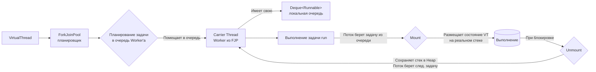

# Java Virtual Threads

Java Virtual Threads модель

Кратко:

```
VirtualThread (легковесный поток) — код
        ↓ 
ForkJoinPool (планировщик) 
        ↓
Carrier Thread (обычный платформенный поток = поток ОС)
        ↓ 
Mount/Unmount механизм (монтируется/демонтируется)
```

**ForkJoinPool** - это пул потоков-носителей (carrier threads). Именно он решает, какой carrier thread возьмёт следующий виртуальный поток


```
VirtualThread блокируется (I/O, сокет)
  → Обнаруживается через механизм JDK (переопределенные операции)
  → VirtualThread ОТМОНТИРОВАЛСЯ от Carrier Thread
  → Сохраняется continuation (стек + состояние)
  → Carrier Thread начинает выполнять ДРУГОЙ VirtualThread из очереди
  → Когда I/O завершен → виртуальный поток в очередь готовых
```

Подробнее:



1. Планирование задачи: Планировщик (`ForkJoinPool`) не отправляет `VirtualThread` абстрактно, он создает задачу (`Runnable`) для выполнения кода этого виртуального потока и помещает её в очередь конкретного `Carrier Thread`. Это и есть планирование (scheduling).

2. Локальная очередь у носителя: Да, у каждого `Carrier Thread` в `ForkJoinPool` есть своя очередь — `Deque<Runnable>`. Это ключевая деталь для **Work-Stealing**: когда поток освобождается, он сначала проверяет свою очередь, а если она пуста — пытается "украсть" задачу из чужой.

3. Выполнение задачи:
    - `Carrier Thread` берет задачу из своей очереди.
    - Эта задача — не что иное, как код виртуального потока.
    - Как только `Carrier` начинает выполнять эту задачу, происходит **Mounting** — состояние виртуального потока (его стек) размещается на реальном стеке `Carrier Thread`.

4. **Unmounting** как переключение:
    - Когда виртуальный поток выполняет блокирующую операцию, вызывается `unmount()`.
    - `Carrier Thread` немедленно сохраняет текущее состояние стека виртуального потока в **Heap**.
    - Затем `Carrier` не ждет завершения операции, а захватывает следующую задачу из своей очереди (или крадет у соседа) и монтирует новый виртуальный поток на себя.
    - Сам же исходный виртуальный поток переходит в состояние ожидания. После завершения I/O он будет помещен обратно в очередь какого-либо `Carrier Thread` (возможно, другого) для повторного монтирования и продолжения работы.


Java Virtual Threads используют вытесняющее (preemptive) планирование только в точках блокировки (I/O, synchronized и т.д.). Если поток занят чистыми вычислениями (CPU-bound), он будет монопольно удерживать поток-носитель (`Carrier Thread`) и не будет вытеснен до завершения или принудительной блокировки. Если ваш код крутит цикл 10 секунд — он займет carrier на всё это время. Бесконечный цикл без I/O заблокирует поток-носитель.
Это связано с тем, что виртуальные потоки в Java создавались в первую очередь для высоконагруженных серверов, работающих с I/O (80-90% времени ожидание). Для CPU-bound задач внутри виртуальных потоков рекомендуется либо их избегать, либо вставлять искусственные точки вызова, например `Thread.sleep(1)` или `Thread.yield()`, чтобы дать шанс другим потокам на выполнение

## Virtual Thread

Проследим полный жизненный цикл виртуального потока (`Virtual Thread`) в Java от момента его создания до того, как он будет собран сборщиком мусора.

### Создание виртуального потока

На этом этапе создается Java-объект VirtualThread. JVM не выделяет под него отдельный стек операционной системы и не привязывает к какому-либо потоку ОС. Вместо этого JVM выделяет в куче (heap) небольшой объект `Continuation`, который будет хранить состояние стека виртуального потока, когда тот не выполняется. Начальный размер этого состояния составляет всего несколько сотен байт

Существует несколько способов создания виртуального потока:
* **Thread.startVirtualThread(Runnable task)**: Создает и сразу же запускает новый виртуальный поток. Это самый простой способ для одноразовых задач.
* **Thread.ofVirtual().start(Runnable task)**: Более гибкий способ через `Builder`, позволяющий задать имя потока, обработчик неперехваченных исключений и другие параметры перед запуском.
* **Executors.newVirtualThreadPerTaskExecutor()**: Создает `ExecutorService`, который для каждой задачи порождает новый виртуальный поток. Это рекомендуемый способ для серверных приложений, так как он позволяет легко управлять множеством задач

### Запуск и планирование (State: NEW -> RUNNABLE)

Когда вызывается метод `.start()`, виртуальный поток не выполняется немедленно. Он помечается как готовый к выполнению (`Runnable`), и JVM ставит его в очередь планировщика. Планировщик виртуальных потоков в Java реализован поверх `ForkJoinPool`. Этот пул работает по принципу **work-stealing**: каждый поток-носитель (`Carrier Thread`) имеет свою очередь задач, и если один поток завершил свои задачи, он может «украсть» задачу из очереди другого, что обеспечивает высокую утилизацию процессорных ядер.

Теперь задача виртуального потока готова к выполнению. Однако в этот момент он еще не привязан к какому-либо потоку ОС.

### Монтирование на поток-носитель (Mounting)

Когда один из потоков пула `ForkJoinPool` (это и есть `Carrier Thread` — обычный платформенный поток ОС) освобождается, он выбирает готовый виртуальный поток из очереди и монтирует (mounts) его на себя.

Процесс монтирования включает в себя:
* Схема монтирования/демонтирования: По сути, JVM находит свободный платформенный поток, чтобы «надеть» на него виртуальный поток для выполнения.
* Восстановление состояния (**Thawing**): JVM достает из кучи сохраненный ранее стек виртуального потока (объект `Continuation`) и «размораживает» его, перенося на реальный стек потока-носителя.
* Начало выполнения: после этого код внутри виртуального потока начинает исполняться.

Теперь виртуальный поток находится в состоянии **RUNNING**.

### Выполнение и блокирующие операции

Пока код виртуального потока выполняет вычисления, все работает как с обычным потоком. Магия происходит в момент блокирующей операции (например, ожидание ответа от БД, вызов `Thread.sleep()`, чтение из сокета). В этот момент срабатывает ключевой механизм виртуальных потоков — демонтирование (**unmounting**):

1. **Обнаружение блокировки**: JVM перехватывает вызов блокирующего метода.
2. **Замораживание** (**Freezing**): JVM сохраняет текущее состояние стека выполнения виртуального потока (все локальные переменные, счетчик команд и т.д.) в специальный объект `Continuation` в куче (heap) и «замораживает» его.
3. **Освобождение носителя**: Виртуальный поток отключается (**unmounts**) от своего потока-носителя. Поток-носитель перестает быть занятым и возвращается в пул `ForkJoinPool` готовым для выполнения следующей виртуальной задачи.
4. **Переход в состояние PARKING**: Сам виртуальный поток переходит в состояние **PARKING** (ожидания).

> Важно отметить, что за время своего существования виртуальный поток может быть смонтирован на разные потоки-носители. Сразу после пробуждения он может оказаться на совершенно другом Carrier Thread из пула.

**Особый случай: Pinning (Фиксация)**

В некоторых случаях виртуальный поток не может быть отмонтирован во время блокировки и вынужден ждать, занимая поток-носитель. Это называется **pinning** (фиксацией). Это происходит при следующих условиях

* **Внутри `synchronized` блока или метода**: Блокировка на мониторе `synchronized` привязывает виртуальный поток к носителю.
* **При выполнении нативного метода (JNI) или внешней функции**: JVM не может безопасно «заморозить» нативный стек.

Такое поведение может существенно снизить масштабируемость, так как поток-носитель блокируется. К счастью, в Java 24 эта проблема была решена в рамках *JEP 491: Synchronize Virtual Threads without Pinning*. В новых версиях `synchronized` больше не вызывает фиксацию, и это стало возможно благодаря внутренним оптимизациям, которые позволяют виртуальным потокам корректно демонтироваться даже внутри синхронизированных блоков.

Для поиска проблемных мест в коде на Java 21 можно использовать флаг `-Djdk.tracePinnedThreads=full`

### Пробуждение и возобновление (Unparking)

Когда операция, на которой заблокирован виртуальный поток, завершается (например, пришел ответ от БД), срабатывает механизм пробуждения:

1. **Сигнал о готовности**: JVM получает уведомление о том, что ресурс стал доступен.
2. **Снятие с ожидания (Unpark)**: JVM переводит виртуальный поток из состояния **PARKING** в состояние **RUNNABLE** (готов к выполнению).
3. **Постановка в очередь**: JVM помещает `Continuation` этого проснувшегося потока обратно в очередь `ForkJoinPool` для планирования.
4. **Повторное монтирование**: Как только один из потоков-носителей пула освобождается, он «размораживает» `Continuation` и монтирует виртуальный поток для продолжения работы, возможно, на другом носителе.

Таким образом, пока виртуальный поток ждал ответа от БД 2 секунды, поток-носитель, на котором он изначально выполнялся, успел обработать тысячи других виртуальных задач, что кардинально повышает общую пропускную способность приложения.

### Завершение и удаление (Garbage Collection)

Виртуальный поток может завершиться естественным образом, когда метод `run()` его задачи выполнится, либо принудительно, если во время ожидания или выполнения был вызван метод `interrupt()`. После завершения потока:

1. Виртуальный поток переходит в состояние **TERMINATED**.
2. Его связь с объектом `Continuation` разрывается.
3. Сборка мусора (Garbage Collection): Объект самого потока и его `Continuation` (стек в куче) больше не имеют сильных ссылок из GC Root (например, из пула `ForkJoinPool`). Поэтому во время следующей сборки мусора они могут быть удалены.
4. Важное отличие от обычных потоков: Стек виртуального потока хранится в куче и не является корнем (**root**) для GC. Это критически важная оптимизация: создание и уничтожение миллионов виртуальных потоков не создает огромной нагрузки на сборщик мусора, так как их стеки не нужно сканировать каждый раз при сборке.

## Итог

* Благодаря хранению стека в куче, вы можете создавать миллионы виртуальных потоков, которые суммарно будут занимать значительно меньше памяти, чем несколько тысяч стандартных потоков.
* **Не создавайте пулы виртуальных потоков**: Создание виртуального потока — очень дешевая операция. Их не нужно кешировать, как это было с платформенными потоками. Наоборот, создавайте новый поток для каждой задачи.
* **Осторожнее с ThreadLocal**: Если вы все же используете `ThreadLocal` с виртуальными потоками, помните, что они живут ровно столько, сколько живет виртуальный поток. Пул виртуальных потоков — это антипаттерн, поэтому и пул объектов через `ThreadLocal` также становится бессмысленным и может привести к утечкам памяти. В качестве современной альтернативы для передачи контекста можно использовать `ScopedValue`.
* **Отслеживайте Pinning**: На Java 21 используйте `-Djdk.tracePinnedThreads` для выявления мест, где виртуальные потоки прибиваются к носителю. Это поможет убедиться, что вы получаете максимальную выгоду от их использования
